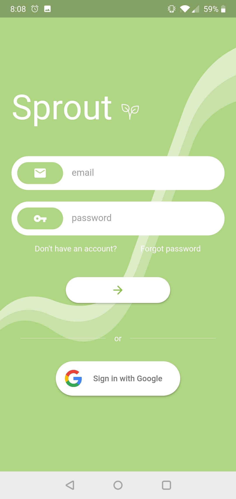
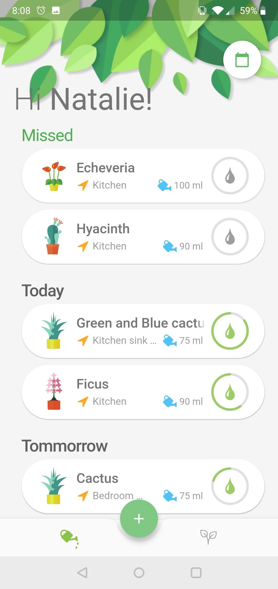

# Sprout

Keep an eye on the important plants in your life. Set watering schedules, read up on their particularities
and get daily reminders to keep up in your busy life

This project is UI prototype for future plant life mobile application.

## Getting Started

* Clone the repository with `git clone`
* Ensure your flutter setup is optimal with `flutter doctor`
* Fetch packages with `flutter pub get`
* Run the app with `flutter run`

## Gallery

    
    

## Other Flutter Resources

- [Lab: Write your first Flutter app](https://flutter.dev/docs/get-started/codelab)
- [Cookbook: Useful Flutter samples](https://flutter.dev/docs/cookbook)

For help getting started with Flutter, view our
[online documentation](https://flutter.dev/docs), which offers tutorials,
samples, guidance on mobile development, and a full API reference.
